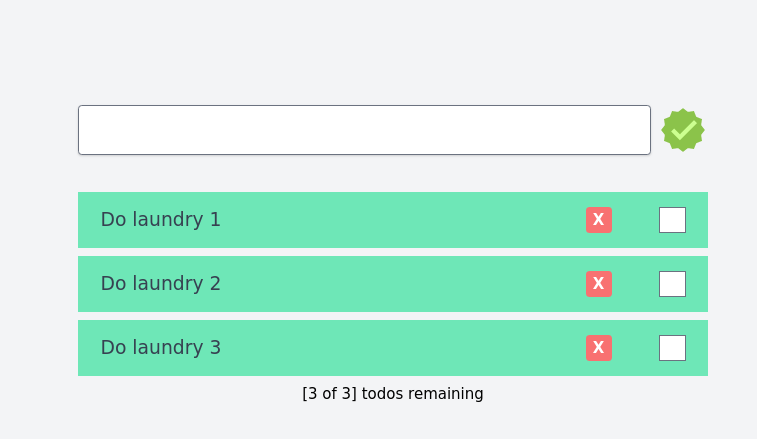

# TypeScript ToDo #

Very basic project for ToDo Notes, the main objective is to apply TypeScript guidelines in the code 

## Concept ##
- Display list of task
- Add a new task
- Update task's status
- Delete a task

## Version 1 specs ##

### Technical Stack ###
* FrontEnd: React, Tailwind and TypeScript
* BackEnd: No DataSource. In Memory records
* Architecture: Not covered

### Available Functions ###
* N/A

### Aditional info ###
* N/A

## Snapshots ##

## Proof of Concept ##
[Todo]

## Bugs ##
Please refer to the Issues section in this repository

## References ##
[Original Tutorial](https://youtu.be/zx_879gAoYo?si=QT2cu-YL0gf89p9P)
